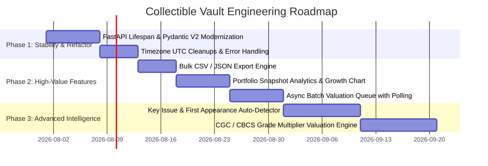

# Architectural Review & Product Roadmap: Collectible Vault

**Author**: Senior Software Engineering Team (Principal Architect, Senior Python Engineer, Product Lead)  
**Date**: July 2026  
**Repository**: [collectible-vault](file:///c:/Users/cereo/OneDrive/Documents/GitHub/collectible-vault)  

---

## Executive Summary

`collectible-vault` is a high-performance, containerized, self-hosted web application for managing comic book, trading card, and action figure collections. It features camera intake, local vision AI (Ollama), native XML import (CLZ/Collectorz schema support), official eBay Browse API integration, FastMCP AI agent tools, and live FMV market comp valuations.

This document presents a comprehensive **Architectural Quality Audit**, **Competitive Feature Benchmark**, and **Prioritized Engineering Roadmap** to scale `collectible-vault` into an industry-grade collection intelligence system.

---

## Section 1: Codebase Architecture & Quality Audit

### 1. Architectural Overview & Strengths
- **Clean Separation of Concerns**: Modular service layout separating database models (`app/models.py`), schema validation (`app/schemas.py`), valuation engine (`app/valuation.py`), vision AI (`app/vision_ai.py`), XML import parser (`app/importers/xml_importer.py`), and API routing (`app/main.py`).
- **Resilient Fallback Hierarchy**: Four-tier valuation strategy prioritizing official eBay Browse API GTIN lookup, primary title query, secondary broad title fallback, MyComicShop benchmark lookup, and a strict $0.00 fallback on missing comps.
- **Statistical Noise Reduction**: In-memory Python post-filtering, keyword exclusion (blocking `lot`, `set`, `cgc`, `omnibus`, `toy`), 3x median price capping, and 1.5x IQR outlier removal.
- **AI Agent Native**: Built-in FastMCP server (`mcp_server.py`) allowing AI assistants to query vault stats, add items, and trigger market valuation refreshes directly.

### 2. Identified Technical Debt & Bottlenecks
1. **Deprecated FastAPI & Pydantic V2 Usage**:
   - `app/main.py` uses `@app.on_event("startup")` (deprecated in FastAPI 0.93+ in favor of `lifespan` context managers).
   - `app/schemas.py` uses `class Config: from_attributes = True`, `.dict()`, and `.from_orm()`, generating runtime `PydanticDeprecatedSince20` warnings.
2. **Blocking I/O on Event Loop**:
   - `refresh_all_valuations()` in `app/valuation.py` executes synchronous HTTP calls with `time.sleep(0.5)` delays inside synchronous route handlers. In production under high concurrency, long-running valuation refreshes block FastAPI worker threads.
3. **Deprecated Datetime UTC Syntax**:
   - Usage of `datetime.utcnow()` across SQLAlchemy defaults and XML importers is deprecated in Python 3.12+ in favor of timezone-aware UTC objects (`datetime.now(timezone.utc)`).
4. **Transaction Atomicity in Bulk XML Import**:
   - `import_comics_from_xml` processes imports in a single DB session transaction. A corrupted entry halfway through a 2,000-item CLZ export can cause a full rollback. Chunked batch commits with partial error reporting will improve stability.

---

## Section 2: Competitive Benchmarking & Market Gap Analysis

| Feature Capability | CovrPrice | CLZ / Collectorz | League of Comic Geeks | Key Collector | **Collectible Vault (Current)** | **Collectible Vault (Proposed)** |
| :--- | :---: | :---: | :---: | :---: | :---: | :---: |
| **Self-Hosted & Private** | ❌ (Cloud) | ❌ (Subscription) | ❌ (Cloud) | ❌ (Mobile Only) | ✅ **100% Local & Self-Hosted** | ✅ **100% Local & Self-Hosted** |
| **Local Vision AI Camera Intake** | ❌ | ❌ | ❌ | ❌ | ✅ **Ollama (qwen2-vl / gemma4)** | ✅ **Ollama + Auto-Correction** |
| **CLZ XML Import** | ❌ | ✅ Native | ❌ | ❌ | ✅ **Native XML Engine** | ✅ **Native XML Engine** |
| **Official eBay Browse API Comps** | ✅ | ❌ | ❌ | ❌ | ✅ **OAuth 2.0 Integration** | ✅ **OAuth 2.0 Integration** |
| **AI Agent MCP Integration** | ❌ | ❌ | ❌ | ❌ | ✅ **FastMCP Support** | ✅ **Extended FastMCP Tools** |
| **Portfolio Value Growth Charts** | ✅ | ✅ | ❌ | ❌ | ⚠️ Single Item History | 🚀 **Vault Growth Timelines** |
| **Key Issue / 1st Appearance Tagging**| ✅ | ⚠️ Basic | ✅ | ✅ Key-Focused | ⚠️ Notes Field Only | 🚀 **Automated Key Tagging** |
| **Bulk CSV / JSON Backup Export** | ❌ | ✅ | ✅ | ❌ | ❌ Missing | 🚀 **One-Click CSV/JSON Export** |
| **Grade Multiplier Matrix (9.8 vs Raw)**| ✅ | ❌ | ❌ | ❌ | ⚠️ Basic Cap | 🚀 **CGC Scale Valuation Matrix** |

---

## Section 3: Prioritized Engineering Roadmap



### Phase 1: Critical Refactors & Technical Debt (Immediate Stability)
- **FastAPI Lifespan Migration**: Replace `@app.on_event("startup")` with `asynccontextmanager`.
- **Pydantic V2 Cleanups**: Convert `.dict()` -> `.model_dump()`, `.from_orm()` -> `.model_validate()`, and `class Config` -> `ConfigDict`.
- **Timezone Cleanups**: Replace `datetime.utcnow()` with `datetime.now(timezone.utc)`.

### Phase 2: Feature Enhancements (Low Effort, High Value)
1. **Bulk CSV / JSON Backup Export Engine**: One-click complete vault backup endpoints (`/api/export/csv`, `/api/export/json`).
2. **Portfolio Value Snapshot & Growth Analytics**: Track daily portfolio value snapshots to render 30d/90d/1y portfolio growth charts.
3. **Async Batch Valuation Queue**: Run valuation refreshes in background worker tasks with a progress status endpoint (`GET /api/valuation/status`).
4. **Enhanced Search & Filter Facets**: Multi-select filtering by publisher, storage location, status (`In Vault`, `For Sale`, `At Grading`, `Sold`), and value ranges.

### Phase 3: Long-Term Vision (Advanced Intelligence)
1. **Key Issue & First Appearance Auto-Detector**: Automatically match comic title/issue against key issue database (e.g. 1st appearance of Venom, Cameo, Origin, Iconic Cover).
2. **CGC / CBCS Grade Multiplier Matrix**: Dynamically scale raw FMV comps using grade ratio curves (e.g., 9.8 = 3.5x, 9.6 = 2.0x, 9.0 = 1.2x, 6.0 = 0.6x).
3. **Barcode Scanner Mobile Web App Integration**: PWA camera scanner for continuous physical box intake.

---

## Section 4: Technical Specifications & Implementations for Top 3 Features

### Feature 1: Historical Portfolio Value Snapshot & Analytics Engine

#### Architecture & Schema
Add `PortfolioSnapshot` model to track aggregated portfolio totals over time.

```python
# app/models.py
class PortfolioSnapshot(Base):
    __tablename__ = "portfolio_snapshots"

    id = Column(Integer, primary_key=True, index=True, autoincrement=True)
    total_items = Column(Integer, nullable=False)
    total_invested = Column(Float, nullable=False)
    current_vault_value = Column(Float, nullable=False)
    total_profit_loss = Column(Float, nullable=False)
    recorded_at = Column(DateTime, default=lambda: datetime.now(timezone.utc))
```

#### REST Endpoint Spec
```python
# app/main.py
@app.get("/api/analytics/portfolio-history")
def get_portfolio_history(days: int = Query(90, ge=7, le=365), db: Session = Depends(get_db)):
    cutoff = datetime.now(timezone.utc) - timedelta(days=days)
    snapshots = db.query(PortfolioSnapshot).filter(PortfolioSnapshot.recorded_at >= cutoff).order_by(PortfolioSnapshot.recorded_at).all()
    return [
        {
            "date": s.recorded_at.strftime("%Y-%m-%d"),
            "invested": s.total_invested,
            "vault_value": s.current_vault_value,
            "profit_loss": s.total_profit_loss
        }
        for s in snapshots
    ]
```

---

### Feature 2: One-Click Bulk Collection Export Engine (CSV / JSON)

#### Architecture
Add streaming CSV and formatted JSON export endpoints for offline backups and spreadsheets.

```python
# app/main.py
import csv
import io
from fastapi.responses import StreamingResponse, JSONResponse

@app.get("/api/export/csv")
def export_vault_csv(db: Session = Depends(get_db)):
    items = db.query(CollectibleItem).all()
    output = io.StringIO()
    writer = csv.writer(output)

    # Header
    writer.writerow([
        "ID", "Title", "Category", "Condition Grade", "Purchase Price",
        "Current Market Value", "Net Profit/Loss", "Barcode", "Notes", "Created At"
    ])

    for i in items:
        profit = round(i.current_market_value - i.purchase_price, 2)
        writer.writerow([
            i.id, i.title, i.category, i.condition_grade, f"{i.purchase_price:.2f}",
            f"{i.current_market_value:.2f}", f"{profit:.2f}", i.barcode or "",
            i.notes or "", i.created_at.strftime("%Y-%m-%d %H:%M:%S")
        ])

    output.seek(0)
    filename = f"collectible_vault_export_{datetime.now().strftime('%Y%m%d')}.csv"
    return StreamingResponse(
        io.BytesIO(output.getvalue().encode("utf-8")),
        media_type="text/csv",
        headers={"Content-Disposition": f"attachment; filename={filename}"}
    )


@app.get("/api/export/json")
def export_vault_json(db: Session = Depends(get_db)):
    items = db.query(CollectibleItem).all()
    data = []
    for i in items:
        data.append({
            "id": i.id,
            "title": i.title,
            "category": i.category,
            "condition_grade": i.condition_grade,
            "purchase_price": i.purchase_price,
            "current_market_value": i.current_market_value,
            "barcode": i.barcode,
            "notes": i.notes,
            "metadata_json": i.metadata_json,
            "created_at": i.created_at.isoformat()
        })
    
    filename = f"collectible_vault_backup_{datetime.now().strftime('%Y%m%d')}.json"
    return JSONResponse(
        content=data,
        headers={"Content-Disposition": f"attachment; filename={filename}"}
    )
```

---

### Feature 3: Non-Blocking Background Batch Valuation Queue with Status Polling

#### Architecture
Decouple batch market valuation refreshes from blocking main event loop threads using FastAPI `BackgroundTasks`.

```python
# app/main.py
from fastapi import BackgroundTasks

_valuation_job_state = {"status": "idle", "total_items": 0, "processed_items": 0, "last_completed": None}

def _async_batch_valuation_task(db_session_factory):
    global _valuation_job_state
    _valuation_job_state["status"] = "running"
    _valuation_job_state["processed_items"] = 0

    db = db_session_factory()
    try:
        items = db.query(CollectibleItem).all()
        _valuation_job_state["total_items"] = len(items)

        for idx, item in enumerate(items):
            if idx > 0:
                time.sleep(0.5)
            new_val = fetch_ebay_sold_comps(item.title, item.category, item.current_market_value, item.condition_grade, item.barcode)
            item.current_market_value = new_val
            db.commit()
            _valuation_job_state["processed_items"] = idx + 1

        _valuation_job_state["status"] = "completed"
        _valuation_job_state["last_completed"] = datetime.now(timezone.utc).isoformat()
    except Exception as e:
        _valuation_job_state["status"] = f"error: {str(e)}"
    finally:
        db.close()


@app.post("/api/valuation/refresh-async")
def trigger_async_valuation(background_tasks: BackgroundTasks):
    global _valuation_job_state
    if _valuation_job_state["status"] == "running":
        return {"status": "already_running", "job": _valuation_job_state}

    background_tasks.add_task(_async_batch_valuation_task, SessionLocal)
    return {"status": "queued", "message": "Batch valuation refresh started in background."}


@app.get("/api/valuation/status")
def get_valuation_status():
    return _valuation_job_state
```
